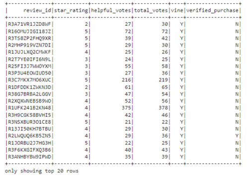
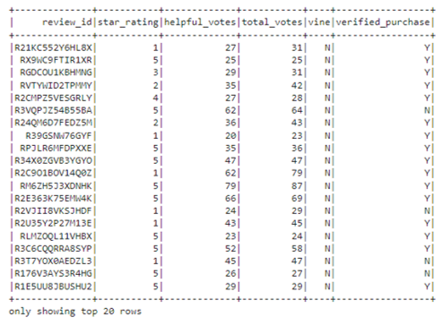

# Amazon_Vine_Analysis

## Project Overview
The Amazon Vine program is a service that allows manufacturers and publishers to receive reviews for their products. Companies pay a small fee to Amazon and provide products to Amazon Vine members, who are then required to publish a review. The purpose of this project was to analyze one of the datasets to determine if there is any bias toward favorable reviews from Vine members. The 5-star reviews are analyzed by paid vs unpaid review.  

## PySpark Results

### Paid (Vine Participants) 
- The number of total reviews in the pet products dataset was 162.
- The number of 5-star reviews was 63.
- The percentage of the reviews that are 5-star was 38.89%

### Unpaid (Non-Vine Participants) 
- The number of total reviews in the pet products dataset was 35,606.
- The number of 5-star reviews was 19444.
- The percentage of the reviews that are 5-star was 54.61%

## Summary
This analysis revealed that there is no positive bias for reviews in the Vine program for Pet Products. The percentage of 5 star reviews for the Vine participating products was 15.72% lower than those who did not participate. This would suggest that participating in the Vine program does not generate a more positive outcome in the reviews for these specific product. 
This analysis could also benefit from further investigation by re-running the analysis on only those reviews with a verified purchase to see if a verified purchase review change anything.

